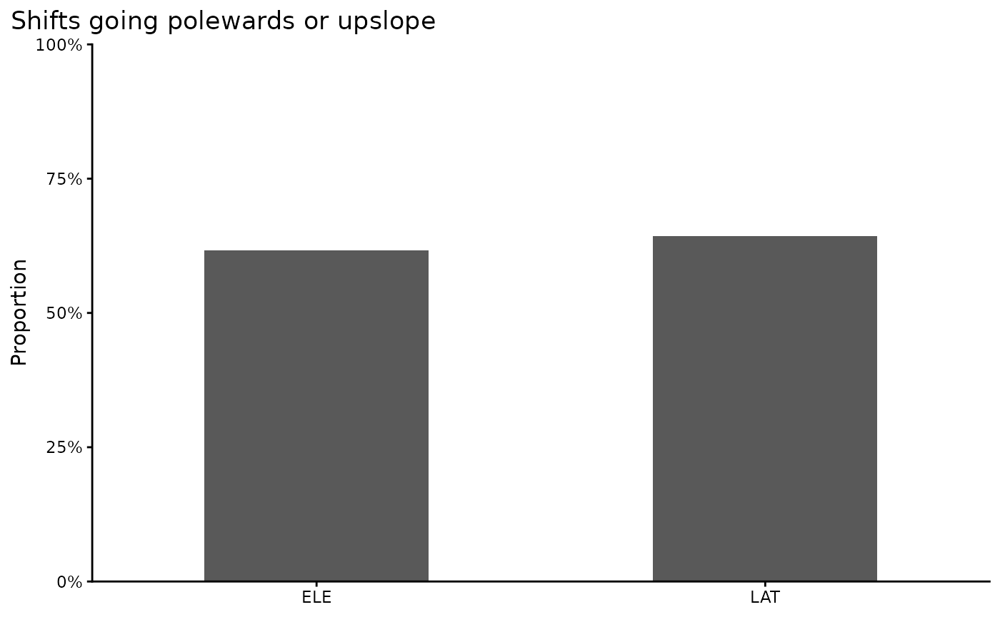

# Curating Data for Hypothesis Testing

## Curating Data for Hypothesis Testing

Here, we demonstrate how BioShifts and the BioShiftR package can be used
to access, subset, and organize bioshifts data for research, hypothesis
testing, and connecting to external data sources.

## Example Scenario

Perhaps we want to evaluate the extent that bird ranges in Europe are
shifting.

### Built-in filter steps

Many of BioShiftR’s functions provide simple methods for targeting,
filtering, and subsetting range shift data. The
[`get_shifts()`](https://bioshifts.github.io/BioShiftR/reference/get_shifts.md)
function, for example, has arguments for continent, type (of range
shift), and group (broad taxonomic and functional classifications); see
the
[`get_shifts()`](https://bioshifts.github.io/BioShiftR/reference/get_shifts.md)
function page for details on options.

Other functions which merge values from other dataframes to the range
shifts database also have filtering options, usually for selecting
study-level or species-specific values. For example, the
[`add_cv()`](https://bioshifts.github.io/BioShiftR/reference/add_cv.md),
[`add_baselines()`](https://bioshifts.github.io/BioShiftR/reference/add_baselines.md),
and
[`add_poly_info()`](https://bioshifts.github.io/BioShiftR/reference/add_poly_info.md)
functions all contain options to either add these values from
species-level or study-level polygons.

### Get the data

In this case, we can use
[`get_shifts()`](https://bioshifts.github.io/BioShiftR/reference/get_shifts.md)
to easily query the 32,000+ range shifts in the BioShifts database to
our target group, target range shift type (here, *latitudinal*), and
target continent.

``` r

library(BioShiftR)
library(dplyr)

# get shifts for only Birds in Europe
eur_birds <- 
  get_shifts(group = "Birds", # filter to birds
             continent = "Europe", #  filter to Europe
             type = c("LAT","ELE") # latitudinal shifts only
             )  

# view data
eur_birds %>% glimpse()
#> Rows: 2,569
#> Columns: 13
#> $ id                  <chr> "A001_P1_ELE_O_M01", "A001_P1_ELE_O_M01", "A001_P1…
#> $ article_id          <chr> "A001", "A001", "A001", "A001", "A001", "A001", "A…
#> $ poly_id             <chr> "P1", "P1", "P1", "P1", "P1", "P1", "P1", "P1", "P…
#> $ method_id           <chr> "M01", "M01", "M01", "M01", "M01", "M01", "M01", "…
#> $ eco                 <chr> "Ter", "Ter", "Ter", "Ter", "Ter", "Ter", "Ter", "…
#> $ type                <chr> "ELE", "ELE", "ELE", "ELE", "ELE", "ELE", "ELE", "…
#> $ param               <chr> "O", "O", "O", "O", "O", "O", "O", "O", "O", "O", …
#> $ sp_name_publication <chr> "Aegithalos_caudatus", "Certhia_familiaris", "Dend…
#> $ sp_name_checked     <chr> "Aegithalos_caudatus", "Certhia_familiaris", "Dend…
#> $ subsp               <chr> NA, NA, NA, NA, NA, NA, NA, NA, NA, NA, NA, NA, NA…
#> $ calc_rate           <dbl> -2.2128, -0.5106, -7.8723, -3.2340, 4.8511, -1.319…
#> $ calc_unit           <chr> "m/year", "m/year", "m/year", "m/year", "m/year", …
#> $ direction           <chr> "Lower Elevation", "Lower Elevation", "Lower Eleva…
```

This produces a dataset of 2,569 examples of bird range shifts, detected
in study areas within the European continent.

### Assess directional trends

First, we will summarize the proportion of estimated shifts that are in
the “expected” directions: First, poleward and upslope.

``` r

library(ggplot2)
eur_birds %>%
  group_by(type) %>%
  summarize(prop_expected = sum(calc_rate > 0)/n()*100) %>%
  ggplot(aes(x = type, y = prop_expected)) +
  geom_col(width = .5) +
  theme_classic() +
  coord_cartesian(xlim = c(.5, 2.5),
                  ylim = c(0,100),
                  expand = F) +
  scale_y_continuous(label = scales::percent_format(scale = 1)) +
  labs(x = NULL, 
       y = "Proportion",
       title = "Shifts going polewards or upslope") +
  theme(plot.title.position = "plot")
```



However, sometimes climate expectations can result in isotherm
velocities that are not in the upslope or poleward directions. With
`BioShiftR`, we can add the climate expectation to further resolve
expected shift rates.

``` r

# add climate velocity
eur_birds_cv <- eur_birds %>%
  # add climate velocity
  add_cv() 
  

eur_birds_cv %>%
  # find proprtion of shifts with same sign as cv
  group_by(type) %>%
  summarize(prop_same_sign = sum(sign(cv_temp_mean) == sign(calc_rate)) / n() * 100) %>%
  
  # plot
    ggplot(aes(x = type, y = prop_same_sign)) +
  geom_col(width = .5) +
  theme_classic() +
  coord_cartesian(xlim = c(.5, 2.5),
                  ylim = c(0,100),
                  expand = F) +
  scale_y_continuous(label = scales::percent_format(scale = 1)) +
  labs(x = NULL, 
       y = "Proportion",
       title = "Shifts going same direction as climate") +
  theme(plot.title.position = "plot")
```


### Assess methodological variables

Shifts are calculated with a wide variety of methods that can affect the
precision of their estimates, or at least, limit the comparisons between
shifts measured in different ways.

``` r

# add methods to birds database
eur_birds_cv_methods <- 
  eur_birds_cv %>%
  add_methods()

# plot based on sample type
eur_birds_cv_methods %>%
  ggplot(aes(x = category,
             y = calc_rate)) +
  geom_boxplot(outliers = F) +
  facet_wrap(~type)
```


