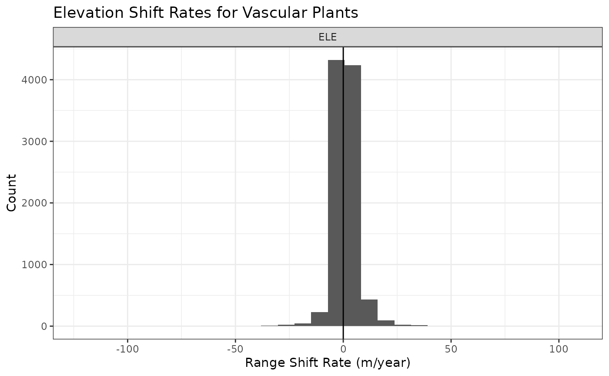
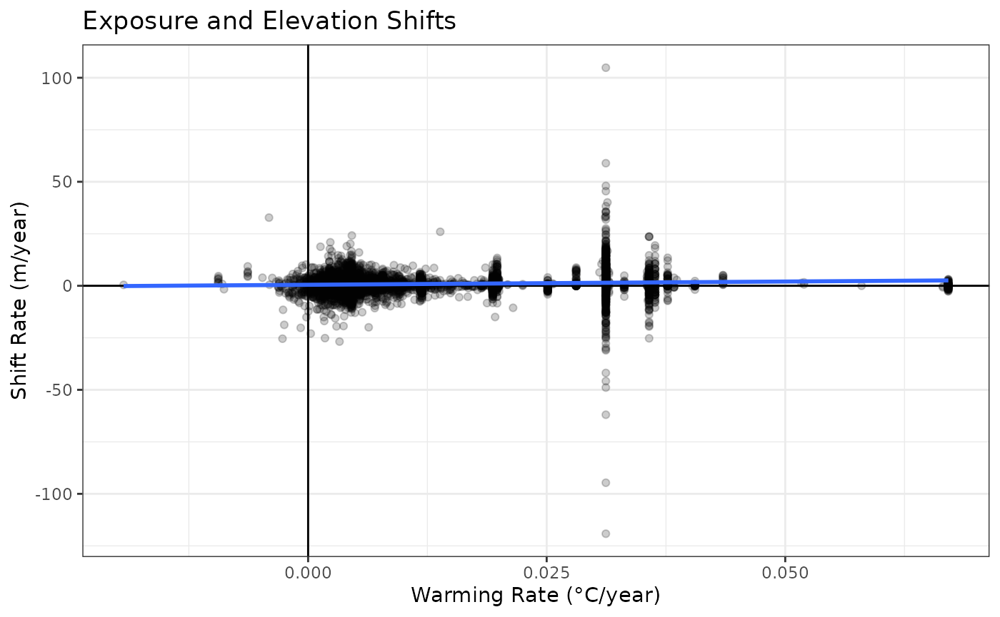

# Curating Data for Hypothesis Testing

## Curating Data for Research and Hypothesis Testing

Here, we demonstrate how BioShifts and the BioShiftR package can be used
to access, subset, and organize bioshifts data for research, hypothesis
testing, and connecting to external data sources.

## Example Scenario: *do plants on faster-warming mountains shift at faster rates?*

Perhaps we want to test whether faster-warming regions have faster range
shifts across latitudes and elevations. Using BioShiftR, we can easily
access and organize data to test targeted hypotheses.

### Built-in filter steps

Many of BioShiftR’s functions provide simple methods for targeting,
filtering, and subsetting range shift data. The
[`get_shifts()`](https://bioshifts.github.io/BioShiftR/reference/get_shifts.md)
function, for example, has arguments for continent, type (of range
shift), and group (broad taxonomic and functional classifications); see
the
[`get_shifts()`](https://bioshifts.github.io/BioShiftR/reference/get_shifts.md)
function page for details on options.

Other functions which merge values from other dataframes to the range
shifts database also have filtering options, usually for selecting
study-level or species-specific values. For example, the
[`add_cv()`](https://bioshifts.github.io/BioShiftR/reference/add_cv.md),
[`add_baselines()`](https://bioshifts.github.io/BioShiftR/reference/add_baselines.md),
and
[`add_poly_info()`](https://bioshifts.github.io/BioShiftR/reference/add_poly_info.md)
functions all contain options to either add these values from
species-level or study-level polygons.

### Get the data

In this case, we can use
[`get_shifts()`](https://bioshifts.github.io/BioShiftR/reference/get_shifts.md)
to easily query the ~32,000 range shifts in the BioShifts database to
our target group, target range shift type, and target continent. Here,
we will query latitudinal and elevational range shifts for plants.

``` r

library(BioShiftR)
library(dplyr)

# get shifts
df <- get_shifts(type = "ELE",
                 group = "Vascular Plants")

# plot a histogram
df %>% ggplot(aes(x = calc_rate)) +
  geom_histogram() +
  facet_wrap(~type, nrow = 2,
             scales= "free_x") +
  geom_vline(xintercept = 0) +
  labs(x = "Range Shift Rate (m/year)",
       y = "Count",
       title = "Elevation Shift Rates for Vascular Plants")
```



## Filter by methods

Here, we are testing the effect of the warming trend within a study’s
duration on the range shift rates observed in species in that region.
Because warming trend and range shift rates are both detected over time,
usually with high amounts of interannual variation, we might assume that
longer durations will produce more reliable signal-to-noise of both
warming trend and range shift rate. We will use this assumption as an
example to demonstrate here how we can add and filter by methods using
`BioShiftR`.

``` r

# add methodological variables to the shifts database
df2 <- df %>%
  add_methods()

# filter to durations over 20 years
df2 <- df2 %>% 
  filter(duration >= 20)
```

### Add exposure variables

Here, we will assess shift rates by climate exposure – or the rate of
warming in the study area and period over which teh shift was observed.
`BioShiftR` includes three functions for adding climate exposure
variables:
[`add_baselines()`](https://bioshifts.github.io/BioShiftR/reference/add_baselines.md)
to add the mean temperature of the regions,
[`add_trends()`](https://bioshifts.github.io/BioShiftR/reference/add_trends.md)
to get the warming trend of the study, and
[`add_cv()`](https://bioshifts.github.io/BioShiftR/reference/add_cv.md)
to add the velocity of isotherm shifts across the latitudinal or
elevational gradients over which shifts are observed. Here, we will use
[`add_trends()`](https://bioshifts.github.io/BioShiftR/reference/add_trends.md)
to get the rate of warming within studies.

``` r


df3 <- df2 %>% 
  # add warming trends: here, we use type = "SP" for species-specific rates
  add_trends(type = "SP") %>%
  # drop those for which we dont have species-specific rate
  tidyr::drop_na(trend_temp_mean)
#> Warning: Not all shifts have associated species-specific polygon values, or
#> values at every resolution. 1526 NAs returned.
```

### Plot the Trend

Here, we will use ggplot’s default model (`geom_smooth()`) to do a
“quick and dirty” assessment of our hypothesis.

``` r

# plot all data and basic model fit
df3 %>%
  ggplot(aes(x = trend_temp_mean, 
             y = calc_rate)) +
  geom_hline(yintercept = 0) +
  geom_vline(xintercept = 0) +
  geom_point(alpha = .2) +
  geom_smooth(method = "lm") +
  labs(x = "Warming Rate (°C/year)",
       y = "Shift Rate (m/year)",
       title = "Exposure and Elevation Shifts")
```



### Addressing Non-Independence of Data

Range shift estimates in BioShifts are collected from many unique
studies that use different methods, are in different locations, and have
different numbers of species within them. This means that data
individual shifts are *not statistically independent*. To address this,
we might use something like a mixed model with a random effect for the
article or polygon in which shifts were identified. Here, we will
simplify to study-level means.

``` r

df3 %>%
  # group by article ID and polygon ID (polygons are within articles)
  group_by(article_id, poly_id) %>%
  # find mean rates
  summarize(calc_rate = mean(calc_rate, na.rm= T),
            trend_temp_mean = mean(trend_temp_mean, na.rm=T),,
            n = n()) %>%
  ggplot(aes(x = trend_temp_mean,
             y = calc_rate)) +
  geom_hline(yintercept = 0) +
  geom_vline(xintercept = 0) +
  geom_point(aes(size = n)) +
  # weight the model by number of shifts observed within a study. 
  geom_smooth(method = "lm",
              aes(weight = n)) +
    labs(x = "Warming Rate (°C/year)",
       y = "Shift Rate (m/year)",
       title = "Exposure and Elevation Shifts -- Study Means",
       size = "n in article")
```


