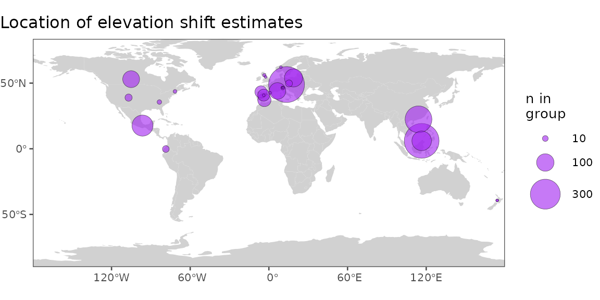
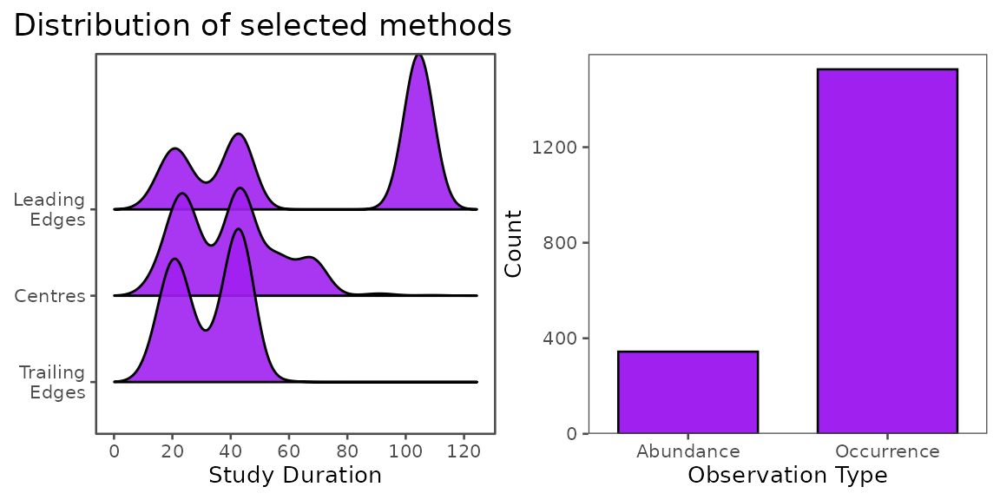
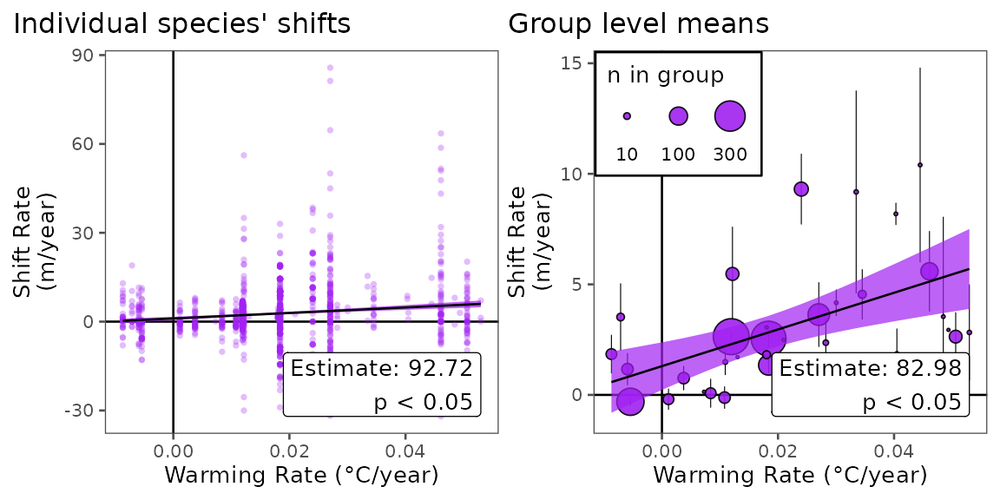

# Curating Data for Hypothesis Testing

## Curating Data for Research and Hypothesis Testing

``` r

library(BioShiftR)
library(dplyr)
library(ggplot2)
theme_set(theme_bw())
```

``` r

# this vignette also uses the following packages for data visualization 
# downstream of BioShiftR functions. They will need to be installed 
# in order to run code from this vignette.
require(ggallin)
require(rnaturalearth)
require(ggridges)
require(plotrix)
```

Here, we demonstrate how BioShifts and the BioShiftR package can be used
to access, subset, and organize bioshifts data for research, hypothesis
testing, and connecting to external data sources.

## Example Scenario: *do terrestrial invertebrates on faster-warming mountains shift at faster rates than those on more slowly-warming mountains?*

Perhaps we want to test whether rates of warming drive upslope range
shifts of global plant species. Using BioShiftR, we can easily access
and organize data to test targeted hypotheses.

### Built-in filter steps

Many of BioShiftR’s functions provide simple methods for targeting,
filtering, and subsetting range shift data. The
[`get_shifts()`](https://bioshifts.github.io/BioShiftR/reference/get_shifts.md)
function, for example, has arguments for continent, type (of range
shift), and group (broad taxonomic/functional classifications); see the
[`get_shifts()`](https://bioshifts.github.io/BioShiftR/reference/get_shifts.md)
function page for details on options.

Other functions which merge values from other dataframes to the range
shifts database also have filtering options, usually for selecting
study-level or species-specific values. For example, the
[`add_cv()`](https://bioshifts.github.io/BioShiftR/reference/add_cv.md),
[`add_baselines()`](https://bioshifts.github.io/BioShiftR/reference/add_baselines.md),
and
[`add_poly_info()`](https://bioshifts.github.io/BioShiftR/reference/add_poly_info.md)
functions all contain options to either add these values from
species-level or study-level polygons.

### Get the data

In this case, we can use
[`get_shifts()`](https://bioshifts.github.io/BioShiftR/reference/get_shifts.md)
to easily query the ~32,000 range shifts in the BioShifts database to
our target group, target range shift type, and target continent. Here,
we will query elevational range shifts for terrestrial invertebrates.

``` r


library(BioShiftR)
library(dplyr)

# get shifts
shifts <- get_shifts(type = "ELE",
                 group = "Terrestrial Invertebrates")
```

### View minimal shift data

Plot a histogram of raw shift rates from the minimal range shifts
dataset.

Show Code

``` r


# plot a histogram
p1 <- shifts %>% 
  
  ggplot(aes(x = calc_rate)) +
  # add histogram
  geom_histogram(fill = "purple", 
                 center = 0,
                 color = "black", 
                 linewidth = .2) +
  
  # add line at zero
  geom_vline(xintercept = 0) +
  
  # transform x axis
  scale_x_continuous(trans = ggallin::ssqrt_trans) +
  
  # labels
  labs(x = "Range Shift Rate (m/year)",
       y = "Count",
       title = "Elevation shift rates for terrestrial invertebrates") + 
  
  # theme
  ggthemes::theme_few(base_size = 10) +
  theme(plot.title.position = "plot") +
  
  # coords
  coord_cartesian(xlim = c(-100, 100),
                  ylim = c(-4, 440),
                  expand = F) +
  
  # annotate n
  annotate(geom = "text",
           x = 90,
           y = 420,
           label = paste0("n = ",scales::comma(nrow(shifts))),
           hjust = 1.2, 
           vjust = 1.2,
           size = 2.5)
```


### Check spatial distribution

Range shift estimations from published literature have important spatial
biases that might limit their inferences. Use the
[`add_polygons()`](https://bioshifts.github.io/BioShiftR/reference/add_polygons.md)
function for viewing individual study areas or species-specific study
areas, or more simply, the
[`add_poly_info()`](https://bioshifts.github.io/BioShiftR/reference/add_poly_info.md)
function for summarized spatial metadata.

``` r

# add polygon info
shifts2 <- shifts %>%
  # add info for study area polygons (type "SA")
  add_poly_info(type = "SA") 
```

#### Plot summarized spatial distribution

Below, we’ll plot the number of terrestrial arthropod elevation shifts
in each article/polygon combination.

Show Code

``` r


# make map ----------------------------------------------------------------
p2 <- shifts2 %>% 
  
  # summarize shifts by article and polygon ID
  group_by(article_id, poly_id, lat_cent_deg, lon_cent_deg) %>%
  summarize(lat_cent_deg = unique(lat_cent_deg),
            lon_cent_deg = unique(lon_cent_deg),
            n = n()) %>%
  arrange(desc(n)) %>%
  
  # plot
  ggplot() + 
  
  # add world geometries
  geom_sf(data = rnaturalearth::ne_countries(returnclass = "sf"),
          fill = "grey82", color = "transparent") +
  
  # add points
  geom_point(aes(x = lon_cent_deg,
                 y = lat_cent_deg,
                 size = n),
  fill = "purple",
  shape = 21,
  stroke = .2, 
  alpha = .6) +
  
  # scale size
  scale_size_area(breaks = c(10,100,300),
                  max_size = 12) +
  
  # theme
  ggthemes::theme_few(base_size = 10) +
  theme(legend.position = "right",
        plot.title.position = "plot",
        legend.justification = c(.5,.5),
        legend.box.background = element_blank(),
        legend.background = element_blank(),
        plot.margin = margin(0,0,0,l=0),
        legend.box = "horizontal") +
  
  coord_sf(expand = F) +
  
  # labs
  labs(x = NULL, 
       y = NULL,
       fill = "Avg. shift\nrate\n(km/yr)",
       size = "n in\ngroup",
       title = "Location of elevation shift estimates") 
```



### Examine methodological variability

Several methodological variables describing how range shifts are
detected are important to consider when comparing shift estimates across
studies. For example, shifts might be estimated with different types of
input data, over different temporal durations, with different sampling
structures, or while defining focal range parameters in different ways.
We collected metadata on 16 methodological variables, which can be
important to consider when analyzing shift rates across studies.

``` r

# add methods to shifts database
shifts3 <- shifts2 %>%
  # add methodological variables
  add_methods()
```

#### Plot methodological variability

View the duration of studies at each range parameter, and the proportion
of shift estimations by observation type. In some cases, methodological
variables such as these might be used to filter shift estimates, or as
random effects to account for methodological differences in statistical
models.

Show Code

``` r


# ridgeplot of study durations by parameter
p3.1 <- shifts3 %>%
  
  # change parameter names and order
  mutate(param2 = recode(param, 
                         "LE" = "Leading\nEdges",
                         "TE" = "Trailing\nEdges",
                         "O" = "Centres")) %>%
  mutate(param2 = factor(param2, levels = c("Trailing\nEdges","Centres","Leading\nEdges"))) %>%
  
  # plot
  ggplot(aes(x = duration, 
             y = param2)) +
  
  # add density ridges
  ggridges::geom_density_ridges2(fill = "purple", alpha = .9) +
  
  # axes
  scale_x_continuous(breaks = scales::pretty_breaks()) +
  
  # theme stuff
  ggthemes::theme_few(base_size = 10) +
  
  # labs
  labs(y = NULL,
       x = "Study Duration") +
  coord_cartesian(clip = "off") 


# bar plot of observation types
p3.2 <- shifts3 %>%
  
  # plot
  ggplot(aes(x = obs_type)) +
  
  # add bars
  geom_bar(width = .7,
           fill = "purple",
           color = "black") +
  
  # coords
  coord_cartesian(xlim = c(.5, 2.5),
                  ylim = c(0, 1590),
                  expand = F) +
  
  # theme stuff
  ggthemes::theme_few(base_size = 10) +
  
  # labs
  scale_x_discrete(labels = c("Abundance","Occurrence")) +
  labs(y = "Count",
       x = "Observation Type") 


library(patchwork)

p3 <- ((
    (p3.1 + theme(plot.margin = margin(r=2))) | (p3.2 + theme(plot.margin = margin(l = 2)))))+
    plot_annotation( title = 'Distribution of selected methods') 
```



### Test association with climate exposure

Here, our hypothesis tests the association of shift rates and the
warming rate of mountain environments, so we’ll use the
[`add_trends()`](https://bioshifts.github.io/BioShiftR/reference/add_trends.md)
function to add warming trends for every estimated shift.

``` r

# add methods to shifts database
shifts4 <- shifts3 %>%
  # add warming trends for study areas
  # `type = "SP"` would add species-level warming trends, but not every 
  # species has total range areas available, so we'll use study-level trends
  # to minimize NAs in the already-limited dataset
  add_trends(type = "SA")
  
```

In order to test this hypothesis, we will model individual shifts as a
function of warming rate, but in reality, individual shifts are not
independent replicates, and thus, linear models on individual shift
estimates might not be appropriate. While there are several possible
ways to deal with nonindependence, here, we will average shift rates
within studies and polygons to create independent samples, then model
the average rates, weighted by n. 

Show Code

``` r


# model shifts as independent 
mod_all <- lm(data = shifts4,
              formula = calc_rate ~ trend_temp_mean)
# pull trend and p_val
mod_all_annotation <- 
  paste0("Estimate: ", round(summary(mod_all)$coefficients["trend_temp_mean","Estimate"], 2), "\n",
         "p ", ifelse(summary(mod_all)$coefficients["trend_temp_mean","Pr(>|t|)"] < .05, "< 0.05", round(summary(mod_all)$coefficients["trend_temp_mean","Pr(>|t|)"], 2)))
# augment model
mod_all_au <- broom::augment(mod_all, interval = "confidence")

# plot
p4.1 <- mod_all_au %>%
  
  # plot
    ggplot(aes(x = trend_temp_mean, 
               y = calc_rate)) +
  
  # add x and y lines at 0
    geom_hline(yintercept = 0) +
    geom_vline(xintercept = 0) +
  
  # add raw points
    geom_point(alpha = .3,
               color = "purple",
               shape = 16,
               size = 1) +
  
  # add confidence interval
    geom_ribbon(aes(ymin = .lower, 
                    ymax = .upper),
                fill = "purple", alpha = .7) +
  
  # add fitted line
    geom_line(aes(y = .fitted)) +
    
  # labs
    labs(x = "Warming Rate (°C/year)",
         y = "Shift Rate\n(m/year)",
         title = "Individual species' shifts") +
    
  # theme
    ggthemes::theme_few(base_size = 10) +
    theme(plot.title.position = "plot") +
  
  # add annotation
  annotate(geom = "label",
           x = max(shifts4$trend_temp_mean),
           y = min(shifts4$calc_rate),
           label = mod_all_annotation,
           hjust = 1,
           vjust = 0)


# summarize by study ID, polygon ID, and timeframe of sampling
shifts4_means <- shifts4 %>%
    # group by article ID and polygon ID (polygons are within articles)
    group_by(article_id, poly_id, midpoint_firstperiod, midpoint_lastperiod) %>%
    # find mean rates
    summarize(
        se_calc_rate = plotrix::std.error(calc_rate),
        se_trend = plotrix::std.error(trend_temp_mean),
        calc_rate = mean(calc_rate, na.rm= T),
        trend_temp_mean = mean(trend_temp_mean, na.rm=T),,
        n = n()) 


# plot mean data and basic model fit
mod_means <- lm(data = shifts4_means,
              formula = calc_rate ~ trend_temp_mean,
              weights = sqrt(n)) #sqrt the weights to normalize them a bit
mod_means_annotation <- 
  paste0("Estimate: ", round(summary(mod_means)$coefficients["trend_temp_mean","Estimate"], 2), "\n",
         "p ", ifelse(summary(mod_means)$coefficients["trend_temp_mean","Pr(>|t|)"] < .05, "< 0.05", round(summary(mod_means)$coefficients["trend_temp_mean","Pr(>|t|)"], 2)))
mod_means_au <- broom::augment(mod_means, shifts4_means, interval = "confidence")

# plot
p4.2 <- mod_means_au %>% 
  
  # start plot
    ggplot(aes(x = trend_temp_mean,
               y = calc_rate)) +
  
  # add x and y lines at 0
    geom_hline(yintercept = 0) +
    geom_vline(xintercept = 0) +
    
    # add raw data
    geom_errorbar(aes(xmin = trend_temp_mean - se_trend,
                      xmax = trend_temp_mean + se_trend),
                  linewidth = .2) +
    geom_errorbar(aes(ymin = calc_rate - se_calc_rate,
                      ymax = calc_rate + se_calc_rate),
                  linewidth = .2) +
    geom_point(alpha = .9,
               fill = "purple",
               shape = 21,
              # size = 2,
               aes(size = n)
              ) +

    
    # add confidence interval
    geom_ribbon(aes(ymin = .lower, 
                    ymax = .upper),
                fill = "purple", alpha = .7) +
  # add fitted line
    geom_line(data = mod_means_au,
              aes(y = .fitted)) +
    
  # scale point size
    scale_size_area(breaks = c(10,100,300),
                    max_size = 7) +
    
    # labels
    labs(x = "Warming Rate (°C/year)",
         y = "Shift Rate\n(m/year)",
         title = "Group level means",
         size = "n in group") +
    
  # theme
    ggthemes::theme_few(base_size = 10) +
    theme(plot.title.position = "plot",
          legend.position = "inside",
          legend.position.inside = c(.005, .995),
          legend.justification = c(0,1),
          legend.direction = "horizontal",
          legend.title.position = "top",
          legend.background = element_rect(color = "black"),
          legend.text.position = "bottom") +
  
    # add annotation
  annotate(geom = "label",
           x = max(shifts4_means$trend_temp_mean),
           y = min(shifts4_means$calc_rate - shifts4_means$se_calc_rate, na.rm=T),
           label = mod_means_annotation,
           hjust = 1,
           vjust = 0)
    


# merge plots
p4 <- ((
    (p4.1 + theme(plot.margin = margin(r=2))) | (p4.2 + theme(plot.margin = margin(l = 2)))))
```



## Conclusion

Here, we demonstrate how the `BioShiftR` package can be used to quickly
and simply access data for hypothesis testing for drivers of species’
range shifts. We show that (from this basic analysis), warming rate
seems to be significantly positively correlated with shift rates of
terrestrial invertebrates up elevational gradients, in agreement with
past studies. While the extent of data and complexity of models that
could be tested with *BioShifts v2* and `BioShiftR` expand far past what
is done here, this workflow serves as one example of how these tools can
aid in testing hypotheses about species’ redistributions at a global
scale.
